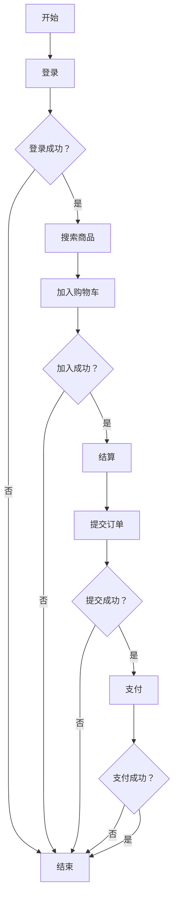

# 轻商城litemall项目业务流程图

## 文档信息
- 文档编号：[FL-LCM-001]
- 版本：1.0
- 编写日期：2024.01.01
- 编写人：业务分析师
- 审核人：产品经理

## 主要业务流程：用户购物流程

## 流程说明
1. **登录**：用户通过手机号和密码登录系统
2. **登录成功验证**：系统验证用户身份，验证失败则返回登录步骤
3. **搜索商品**：用户在系统中搜索需要购买的商品
4. **加入购物车**：用户将选中的商品添加到购物车
5. **加入成功验证**：系统确认商品是否成功加入购物车，失败则返回加入购物车步骤
6. **结算**：用户进入结算页面，确认订单信息
7. **提交订单**：用户确认订单信息后提交订单
8. **提交成功验证**：系统确认订单是否成功提交，失败则返回提交订单步骤
9. **支付**：用户选择支付方式进行支付
10. **支付成功验证**：系统确认支付是否成功，失败则返回支付步骤
11. **结束**：购物流程完成

## 分支说明
- 登录失败：用户需重新输入正确的登录信息或进行注册
- 加入购物车失败：可能由于商品库存不足、系统错误等原因，用户需重新尝试或选择其他商品
- 提交订单失败：可能由于地址信息不全、优惠券使用条件不满足等原因，用户需修正相关信息后重新提交
- 支付失败：用户需重新选择支付方式或检查支付账户余额后重新尝试支付

---
**更新时间**：2025-10-05