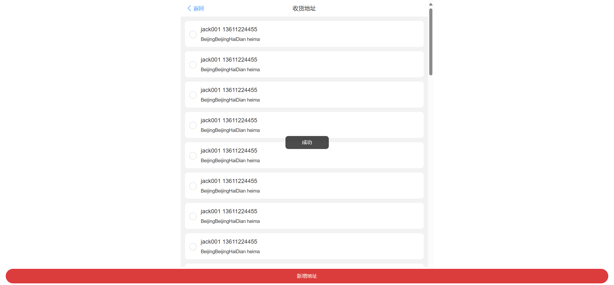
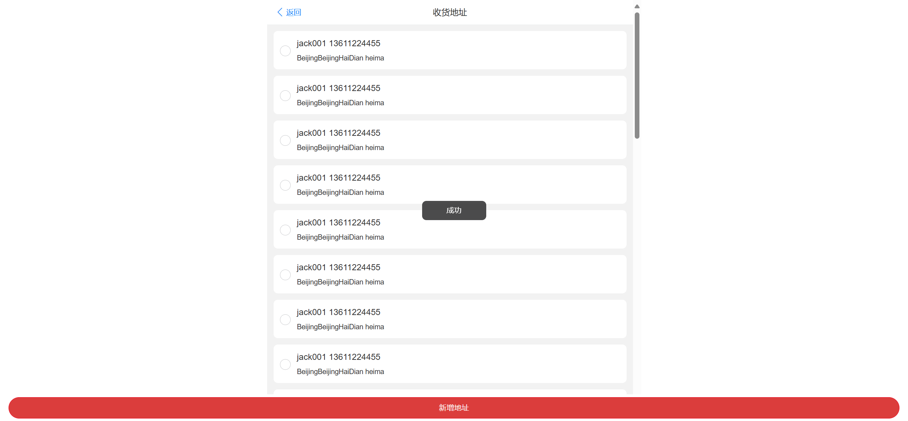
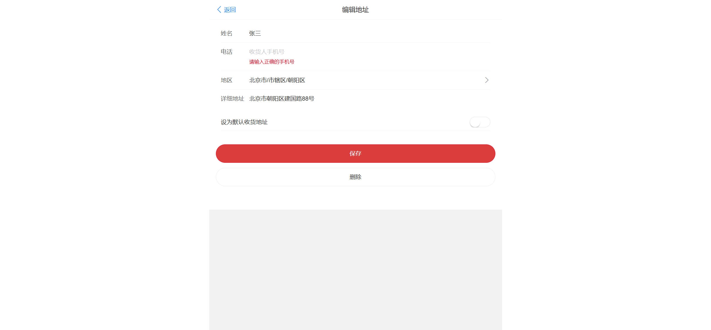
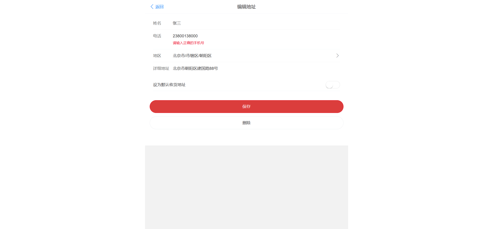
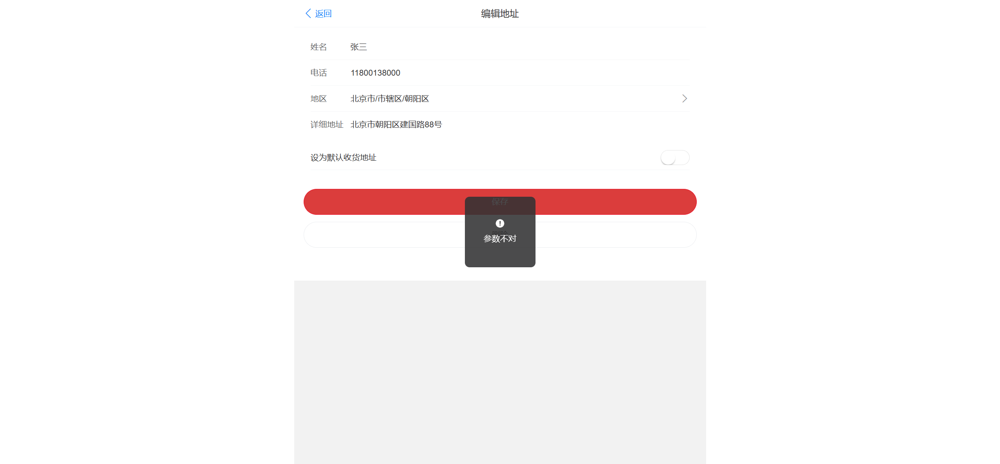
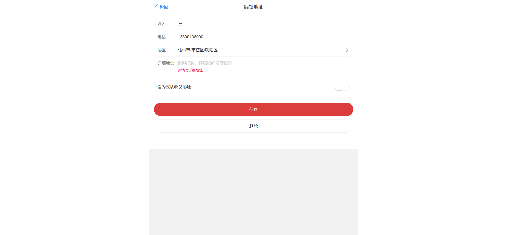
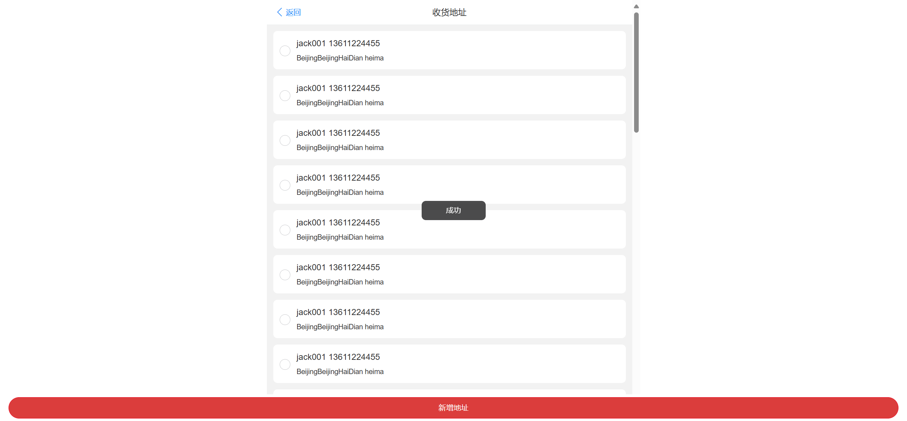
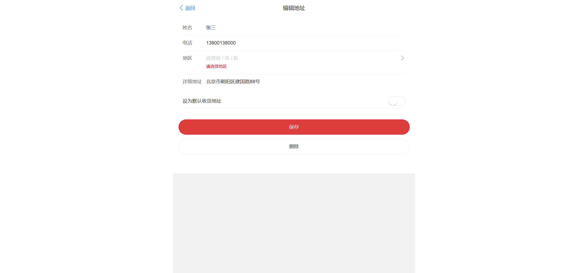

# UI测试用例文档 - 地址管理模块（自动化）

| 序号 | 用例编号   | 用例标题                                             | 模块             | 优先级 | 前置条件                             | 测试步骤                                                                                                                                                                                                       | 测试数据                                                                                                                                                                                                                                               | 预期结果                                                             | 执行结果 | 测试人     | 测试时间   | 实际结果                                              |
| ---- | ---------- | ---------------------------------------------------- | ---------------- | ------ | ------------------------------------ | -------------------------------------------------------------------------------------------------------------------------------------------------------------------------------------------------------------- | ------------------------------------------------------------------------------------------------------------------------------------------------------------------------------------------------------------------------------------------------------ | -------------------------------------------------------------------- | -------- | ---------- | ---------- | ----------------------------------------------------- |
| 0    | Address001 | 添加地址成功（所有条件符合）                         | 添加收货地址功能 | P0     | 用户已登录到系统                     | 1. 进入添加收货地址页面；2. 输入符合要求的姓名（32个字符）；3. 输入符合要求的详细地址（50个字符）；`<bar>`4. 选择正确的省份、城市、区县；5. 输入正确的地区码和邮编；6. 选择是否设为默认地址；7. 点击提交按钮 | 姓名："张三李四王五赵六钱孙周吴郑王甲乙丙丁戊己庚辛"（32个字符）；详细地址："北京市朝阳区建国路88号SOHO现代城B座2501室，工作时间请联系前台"（50个字符）；`<bar>`省份：北京市；城市：北京市；区县：朝阳区；地区码：100022；邮编：100022；默认地址：否 | 地址添加成功，显示"添加成功"提示，新地址显示在地址列表顶部           | 通过     | 测试工程师 | 2025/10/16 |  |
| 1    | Address002 | 添加地址失败（姓名为空）                             | 添加收货地址功能 | P1     | 用户已登录到系统                     | 1. 进入添加收货地址页面；2. 不输入姓名；3. 输入其他必要信息；4. 点击提交按钮                                                                                                                                   | 姓名：空；其他信息：有效                                                                                                                                                                                                                               | 提示"姓名不能为空"                                                 | 通过     | 测试工程师 | 2025/10/16 |  |
| 2    | Address003 | 添加地址失败（姓名65个字符）                         | 添加收货地址功能 | P1     | 用户已登录到系统                     | 1. 进入添加收货地址页面；2. 输入65个字符的姓名；3. 输入其他必要信息；4. 点击提交按钮                                                                                                                           | 姓名："一二三四五六七八九十一二三四五六七八九十一二三四五六"（65个字符）；其他信息：有效                                                                                                                       | 提示"姓名长度不能超过64个字符"                                     | 不通过   | 测试工程师 | 2025/10/16 |  |
| 3    | Address004 | 添加地址失败（手机号为空）                           | 添加收货地址功能 | P1     | 用户已登录到系统                     | 1. 进入添加收货地址页面；2. 不输入手机号；3. 输入其他必要信息；4. 点击提交按钮                                                                                                                                 | 手机号：空；其他信息：有效                                                                                                                                                                                                                             | 提示"手机号不能为空"                                               | 通过     | 测试工程师 | 2025/10/16 |  |
| 4    | Address005 | 添加地址失败（手机号非11位数字）                     | 添加收货地址功能 | P1     | 用户已登录到系统                     | 1. 进入添加收货地址页面；2. 输入非11位数字的手机号；3. 输入其他必要信息；4. 点击提交按钮                                                                                                                       | 手机号："1380013800"（10位数字）；其他信息：有效                                                                                                                                                                                                       | 提示"手机号必须是11位数字"                                         | 通过     | 测试工程师 | 2025/10/16 |  |
| 5    | Address006 | 添加地址失败（手机号11位非数字）                     | 添加收货地址功能 | P1     | 用户已登录到系统                     | 1. 进入添加收货地址页面；2. 输入11位非数字的手机号；3. 输入其他必要信息；4. 点击提交按钮                                                                                                                       | 手机号："13800abcdef"（11位混合字符）；其他信息：有效                                                                                                                                                                                                  | 提示"手机号必须是数字"                                             | 通过     | 测试工程师 | 2025/10/16 |  |
| 6    | Address007 | 添加地址失败（手机号第一个数字非1）                  | 添加收货地址功能 | P1     | 用户已登录到系统                     | 1. 进入添加收货地址页面；2. 输入第一个数字非1的11位手机号；3. 输入其他必要信息；4. 点击提交按钮                                                                                                                | 手机号："23800138000"（第一个数字非1的11位数字）；其他信息：有效                                                                                                                                                                                       | 提示"手机号格式不正确"                                             | 通过     | 测试工程师 | 2025/10/16 |  |
| 7    | Address008 | 添加地址失败（手机号第二个数字小于2）                | 添加收货地址功能 | P1     | 用户已登录到系统                     | 1. 进入添加收货地址页面；2. 输入第二个数字小于2的11位手机号；3. 输入其他必要信息；4. 点击提交按钮                                                                                                              | 手机号："11800138000"（第二个数字为1小于2的11位数字）；其他信息：有效                                                                                                                                                                                  | 提示"手机号格式不正确"                                             | 不通过   | 测试工程师 | 2025/10/16 |  |
| 8    | Address009 | 添加地址失败（详细地址为空）                         | 添加收货地址功能 | P1     | 用户已登录到系统                     | 1. 进入添加收货地址页面；2. 不输入详细地址；3. 输入其他必要信息；4. 点击提交按钮                                                                                                                               | 详细地址：空；其他信息：有效                                                                                                                                                                                                                           | 提示"详细地址不能为空"                                             | 通过     | 测试工程师 | 2025/10/16 |  |
| 9    | Address010 | 添加地址失败（详细地址超过100个字符）                | 添加收货地址功能 | P1     | 用户已登录到系统                     | 1. 进入添加收货地址页面；2. 输入超过100个字符的详细地址；3. 输入其他必要信息；4. 点击提交按钮                                                                                                                  | 详细地址："北京市朝阳区建国路88号SOHO现代城B座2501室，工作时间请联系前台。`<bar>`北京市朝阳区建国路88号SOHO现代城B座2501室，工作时间请联系前台。北京市朝阳区建国路88号SOHO现代城B座2501室，工作时间请联系前台。"（超过100个字符）；其他信息：有效    | 提示"详细地址长度不能超过100个字符"                                | 不通过   | 测试工程师 | 2025/10/16 |  |
| 10   | Address011 | 添加地址失败（已存在默认地址情况下再次填写默认地址） | 添加收货地址功能 | P2     | 用户已登录到系统，且已有一个默认地址 | 1. 进入添加收货地址页面；2. 再次选择设为默认地址；3. 输入其他必要信息；4. 点击提交按钮                                                                                                                         | 默认地址：是；其他信息：有效                                                                                                                                                                                                                           | 提示"已存在默认地址，请确认是否更改"或类似提示（根据实际业务逻辑） | 不通过   | 测试工程师 | 2025/10/16 |  |
| 11   | Address012 | 添加地址失败（不选择地区）                           | 添加收货地址功能 | P1     | 用户已登录到系统                     | 1. 进入添加收货地址页面；2. 输入符合要求的姓名、手机号、详细地址；3. 不选择省份、城市、区县；4. 输入地区码和邮编；5. 点击提交按钮                                                                              | 姓名：张三；手机号：13800138000；详细地址：北京市朝阳区建国路88号；省份：空；城市：空；区县：空；地区码：100022；邮编：100022；默认地址：否                                                                                                            | 提示"请选择完整的地区信息"或"地区信息不能为空"                   | 通过     | 测试工程师 | 2025/10/16 |  |
