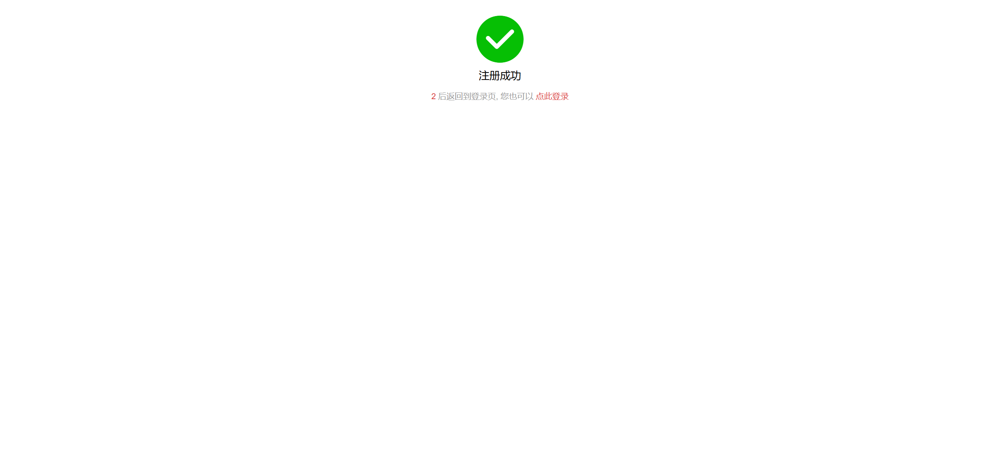
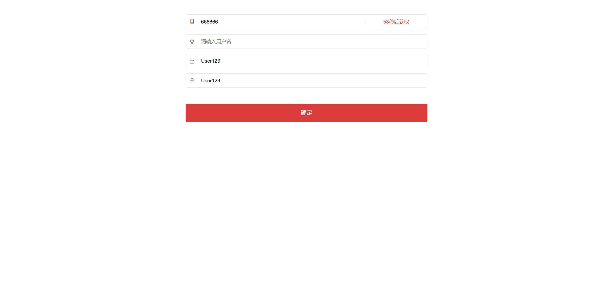
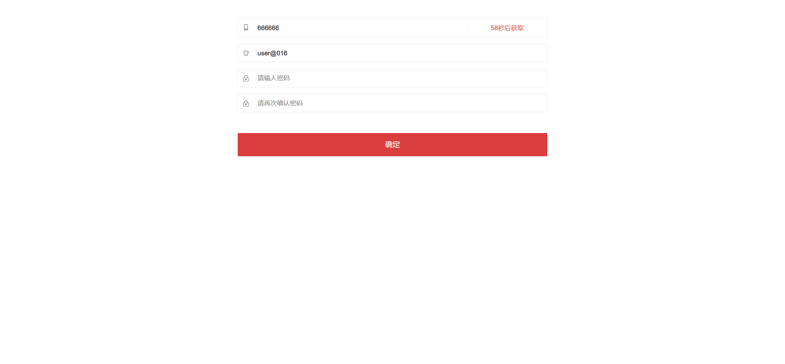
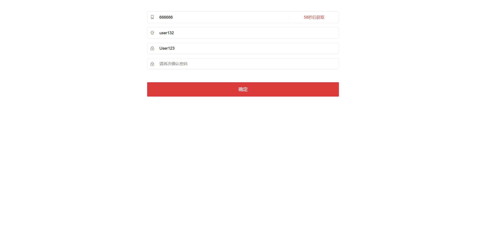
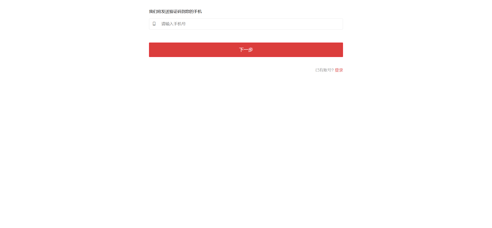
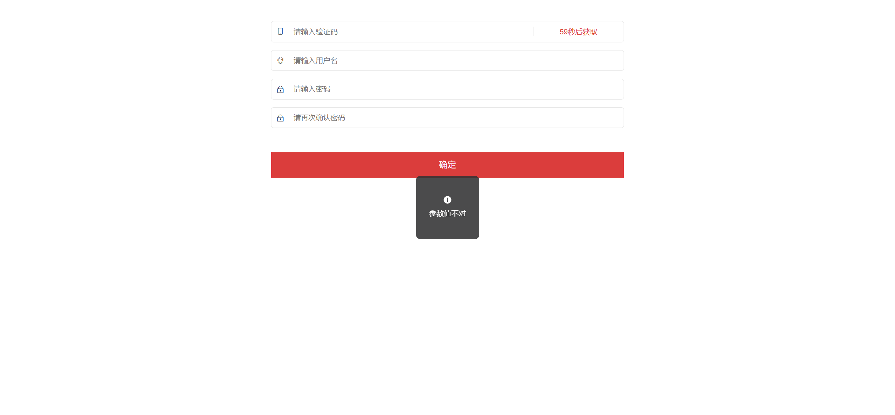
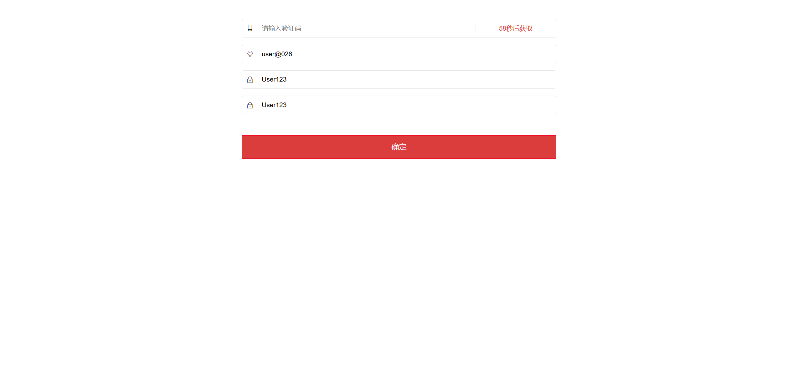
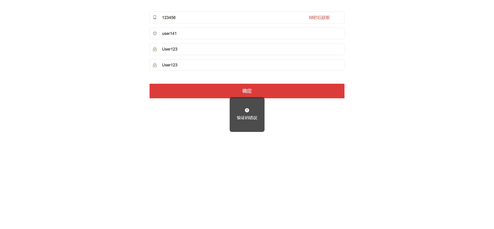

# UI测试用例文档 - 用户注册模块（自动化）

| 序号 | 用例编号 | 用例标题                      | 模块     | 优先级 | 前置条件 | 测试步骤                                                                                                                                                                            | 测试数据                                                                                            | 预期结果                                         | 执行结果 | 测试人     | 测试时间   | 实际结果                                              |
| ---- | -------- | ----------------------------- | -------- | ------ | -------- | ----------------------------------------------------------------------------------------------------------------------------------------------------------------------------------- | --------------------------------------------------------------------------------------------------- | ------------------------------------------------ | -------- | ---------- | ---------- | ----------------------------------------------------- |
| 0    | Reg001   | 成功注册流程-所有信息正确     | 用户注册 | P0     | 无       | 1. 进入注册页面；` `2. 输入用户名、手机号、密码、确认密码；` `3. 获取验证码；` `4. 输入验证码；` `5. 点击注册按钮                                               | 用户名：user123；手机号：13800138001；密码：User123；确认密码：User123；有效验证码                  | 注册成功，用户账号创建，跳转至登录页面           | 通过     | 测试工程师 | 2025/10/16 |  |
| 1    | Reg002   | 用户名边界值-最小长度(4位)    | 用户注册 | P1     | 无       | 1. 进入注册页面；` `2. 输入4位用户名、手机号、密码、确认密码；` `3. 获取验证码；` `4. 输入验证码；` `5. 点击注册按钮                                            | 用户名：user；手机号：13800138002；密码：User123；确认密码：User123；有效验证码                     | 注册成功，用户账号创建，跳转至登录页面           | 通过     | 测试工程师 | 2025/10/16 |  |
| 2    | Reg003   | 用户名边界值-最大长度(20位)   | 用户注册 | P1     | 无       | 1. 进入注册页面；` `2. 输入20位用户名、手机号、密码、确认密码；` `3. 获取验证码；` `4. 输入验证码；` `5. 点击注册按钮                                           | 用户名：user1234567890123456789；手机号：13800138003；密码：User123；确认密码：User123；有效验证码  | 注册成功，用户账号创建，跳转至登录页面           | 通过     | 测试工程师 | 2025/10/16 |  |
| 3    | Reg004   | 用户名-长度小于最小要求(3位)  | 用户注册 | P1     | 无       | 1. 进入注册页面；` `2. 输入3位用户名、手机号、密码、确认密码；` `3. 获取验证码；` `4. 输入验证码；` `5. 点击注册按钮                                            | 用户名：use；手机号：13800138004；密码：User123；确认密码：User123；有效验证码                      | 注册失败，提示"用户名长度应为4-20位"             | 不通过   | 测试工程师 | 2025/10/16 |  |
| 4    | Reg005   | 用户名-长度大于最大要求(21位) | 用户注册 | P1     | 无       | 1. 进入注册页面；` `2. 输入21位用户名、手机号、密码、确认密码；` `3. 获取验证码；` `4. 输入验证码；` `5. 点击注册按钮                                           | 用户名：user12345678901234567890；手机号：13800138005；密码：User123；确认密码：User123；有效验证码 | 注册失败，提示"用户名长度应为4-20位"             | 不通过   | 测试工程师 | 2025/10/16 |  |
| 5    | Reg006   | 用户名-包含特殊字符           | 用户注册 | P1     | 无       | 1. 进入注册页面；` `2. 输入包含特殊字符的用户名、手机号、密码、确认密码；` `3. 获取验证码；` `4. 输入验证码；` `5. 点击注册按钮                                 | 用户名：user@123；手机号：13800138006；密码：User123；确认密码：User123；有效验证码                 | 注册失败，提示"用户名只能包含字母、数字、下划线" | 不通过   | 测试工程师 | 2025/10/16 |  |
| 6    | Reg007   | 用户名-包含汉字               | 用户注册 | P1     | 无       | 1. 进入注册页面；` `2. 输入包含汉字的用户名、手机号、密码、确认密码；` `3. 获取验证码；` `4. 输入验证码；` `5. 点击注册按钮                                     | 用户名：user测试；手机号：13800138007；密码：User123；确认密码：User123；有效验证码                 | 注册失败，提示"用户名只能包含字母、数字、下划线" | 不通过   | 测试工程师 | 2025/10/16 |  |
| 7    | Reg008   | 用户名-已存在                 | 用户注册 | P1     | 无       | 1. 进入注册页面；` `2. 输入已存在的用户名；` `3. 输入手机号、密码、确认密码；` `4. 获取验证码；` `5. 输入验证码；` `6. 点击注册按钮                        | 用户名：user123；手机号：13800138008；密码：User123；确认密码：User123；有效验证码                  | 注册失败，提示"用户名已存在"                     | 不通过   | 测试工程师 | 2025/10/16 |  |
| 8    | Reg009   | 用户名-空                     | 用户注册 | P1     | 无       | 1. 进入注册页面；` `2. 用户名为空；` `3. 输入手机号、密码、确认密码；` `4. 获取验证码；` `5. 输入验证码；` `6. 点击注册按钮                                | 用户名：空；手机号：13800138009；密码：User123；确认密码：User123；有效验证码                       | 注册失败，提示"用户名不能为空"                   | 不通过   | 测试工程师 | 2025/10/16 |  |
| 9    | Reg010   | 密码边界值-最小长度(6位)      | 用户注册 | P1     | 无       | 1. 进入注册页面；` `2. 输入用户名、手机号；` `3. 输入6位字母数字组合密码；` `4. 输入确认密码；` `5. 获取验证码；` `6. 输入验证码；` `7. 点击注册按钮  | 用户名：user@010；手机号：13800138010；密码：Pass1；确认密码：Pass1；有效验证码                     | 注册成功，用户账号创建，跳转至登录页面           | 通过     | 测试工程师 | 2025/10/16 |  |
| 10   | Reg011   | 密码边界值-最大长度(12位)     | 用户注册 | P1     | 无       | 1. 进入注册页面；` `2. 输入用户名、手机号；` `3. 输入12位字母数字组合密码；` `4. 输入确认密码；` `5. 获取验证码；` `6. 输入验证码；` `7. 点击注册按钮 | 用户名：user@011；手机号：13800138011；密码：Pass12345678；确认密码：Pass12345678；有效验证码       | 注册成功，用户账号创建，跳转至登录页面           | 通过     | 测试工程师 | 2025/10/16 |  |
| 11   | Reg012   | 密码-长度小于最小要求(5位)    | 用户注册 | P1     | 无       | 1. 进入注册页面；` `2. 输入用户名、手机号；` `3. 输入5位密码；` `4. 输入确认密码；` `5. 获取验证码；` `6. 输入验证码；` `7. 点击注册按钮              | 用户名：user@012；手机号：13800138012；密码：Pass；确认密码：Pass；有效验证码                       | 注册失败，提示"密码长度应为6-12位"               | 不通过   | 测试工程师 | 2025/10/16 |  |
| 12   | Reg013   | 密码-长度大于最大要求(13位)   | 用户注册 | P1     | 无       | 1. 进入注册页面；` `2. 输入用户名、手机号；` `3. 输入13位密码；` `4. 输入确认密码；` `5. 获取验证码；` `6. 输入验证码；` `7. 点击注册按钮             | 用户名：user@013；手机号：13800138013；密码：Pass123456789；确认密码：Pass123456789；有效验证码     | 注册失败，提示"密码长度应为6-12位"               | 不通过   | 测试工程师 | 2025/10/16 |  |
| 13   | Reg014   | 密码-纯数字                   | 用户注册 | P1     | 无       | 1. 进入注册页面；` `2. 输入用户名、手机号；` `3. 输入纯数字密码；` `4. 输入确认密码；` `5. 获取验证码；` `6. 输入验证码；` `7. 点击注册按钮           | 用户名：user@014；手机号：13800138014；密码：123456；确认密码：123456；有效验证码                   | 注册失败，提示"密码必须包含字母和数字"           | 不通过   | 测试工程师 | 2025/10/16 |  |
| 14   | Reg015   | 密码-纯字母                   | 用户注册 | P1     | 无       | 1. 进入注册页面；` `2. 输入用户名、手机号；` `3. 输入纯字母密码；` `4. 输入确认密码；` `5. 获取验证码；` `6. 输入验证码；` `7. 点击注册按钮           | 用户名：user@015；手机号：13800138015；密码：Password；确认密码：Password；有效验证码               | 注册失败，提示"密码必须包含字母和数字"           | 不通过   | 测试工程师 | 2025/10/16 |  |
| 15   | Reg016   | 密码-空                       | 用户注册 | P1     | 无       | 1. 进入注册页面；` `2. 输入用户名、手机号；` `3. 密码为空；` `4. 输入确认密码；` `5. 获取验证码；` `6. 输入验证码；` `7. 点击注册按钮                 | 用户名：user@016；手机号：13800138016；密码：空；确认密码：空；有效验证码                           | 注册失败，提示"密码不能为空"                     | 不通过   | 测试工程师 | 2025/10/16 |  |
| 16   | Reg017   | 确认密码-与密码不一致         | 用户注册 | P1     | 无       | 1. 进入注册页面；` `2. 输入用户名、手机号；` `3. 输入密码；` `4. 输入不同的确认密码；` `5. 获取验证码；` `6. 输入验证码；` `7. 点击注册按钮           | 用户名：user@017；手机号：13800138017；密码：User123；确认密码：User456；有效验证码                 | 注册失败，提示"两次输入密码不一致"               | 不通过   | 测试工程师 | 2025/10/16 |  |
| 17   | Reg018   | 确认密码-空                   | 用户注册 | P1     | 无       | 1. 进入注册页面；` `2. 输入用户名、手机号；` `3. 输入密码；` `4. 确认密码为空；` `5. 获取验证码；` `6. 输入验证码；` `7. 点击注册按钮                 | 用户名：user@018；手机号：13800138018；密码：User123；确认密码：空；有效验证码                      | 注册失败，提示"确认密码不能为空"                 | 不通过   | 测试工程师 | 2025/10/16 |  |
| 18   | Reg019   | 手机号-已注册                 | 用户注册 | P1     | 无       | 1. 进入注册页面；` `2. 输入用户名、已注册手机号、密码、确认密码；` `3. 获取验证码；` `4. 输入验证码；` `5. 点击注册按钮                                         | 用户名：user@019；手机号：14712345678；密码：User123；确认密码：User123；有效验证码                 | 注册失败，提示"手机号已注册"                     | 不通过   | 测试工程师 | 2025/10/16 |  |
| 19   | Reg020   | 手机号-空                     | 用户注册 | P1     | 无       | 1. 进入注册页面；` `2. 输入用户名、密码、确认密码；` `3. 手机号留空；` `4. 获取验证码；` `5. 输入验证码；` `6. 点击注册按钮                                | 用户名：user@020；手机号：空；密码：User123；确认密码：User123；有效验证码                          | 注册失败，提示"手机号不能为空"                   | 不通过   | 测试工程师 | 2025/10/16 |  |
| 20   | Reg021   | 手机号-第一位不为1            | 用户注册 | P1     | 无       | 1. 进入注册页面；` `2. 输入用户名、第一位不为1的手机号、密码、确认密码；` `3. 获取验证码；` `4. 输入验证码；` `5. 点击注册按钮                                  | 用户名：user@021；手机号：23800138018；密码：User123；确认密码：User123；有效验证码                 | 注册失败，提示"手机号格式不正确"                 | 不通过   | 测试工程师 | 2025/10/16 |  |
| 21   | Reg022   | 手机号-第二位小于等于2        | 用户注册 | P1     | 无       | 1. 进入注册页面；` `2. 输入用户名、第二位小于等于2的手机号、密码、确认密码；` `3. 获取验证码；` `4. 输入验证码；` `5. 点击注册按钮                              | 用户名：user@022；手机号：12800138019；密码：User123；确认密码：User123；有效验证码                 | 注册失败，提示"手机号格式不正确"                 | 不通过   | 测试工程师 | 2025/10/16 |  |
| 22   | Reg023   | 手机号-10位数字               | 用户注册 | P1     | 无       | 1. 进入注册页面；` `2. 输入用户名、10位数字手机号、密码、确认密码；` `3. 获取验证码；` `4. 输入验证码；` `5. 点击注册按钮                                       | 用户名：user@023；手机号：1380013800；密码：User123；确认密码：User123；有效验证码                  | 注册失败，提示"手机号格式不正确"                 | 不通过   | 测试工程师 | 2025/10/16 |  |
| 23   | Reg024   | 手机号-12位数字               | 用户注册 | P1     | 无       | 1. 进入注册页面；` `2. 输入用户名、12位数字手机号、密码、确认密码；` `3. 获取验证码；` `4. 输入验证码；` `5. 点击注册按钮                                       | 用户名：user@024；手机号：138001380011；密码：User123；确认密码：User123；有效验证码                | 注册失败，提示"手机号格式不正确"                 | 不通过   | 测试工程师 | 2025/10/16 |  |
| 24   | Reg025   | 手机号-包含非数字字符         | 用户注册 | P1     | 无       | 1. 进入注册页面；` `2. 输入用户名、包含非数字字符的手机号、密码、确认密码；` `3. 获取验证码；` `4. 输入验证码；` `5. 点击注册按钮                               | 用户名：user@025；手机号：1380013800a；密码：User123；确认密码：User123；有效验证码                 | 注册失败，提示"手机号格式不正确"                 | 不通过   | 测试工程师 | 2025/10/16 |  |
| 25   | Reg026   | 验证码-空                     | 用户注册 | P1     | 无       | 1. 进入注册页面；` `2. 输入用户名、手机号、密码、确认密码；` `3. 获取验证码；` `4. 验证码为空；` `5. 点击注册按钮                                               | 用户名：user@026；手机号：13800138019；密码：User123；确认密码：User123；验证码：空                 | 注册失败，提示"验证码不能为空"                   | 不通过   | 测试工程师 | 2025/10/16 |  |
| 26   | Reg027   | 验证码-错误                   | 用户注册 | P1     | 无       | 1. 进入注册页面；` `2. 输入用户名、手机号、密码、确认密码；` `3. 获取验证码；` `4. 输入错误验证码；` `5. 点击注册按钮                                           | 用户名：user@027；手机号：13800138020；密码：User123；确认密码：User123；错误验证码                 | 注册失败，提示"验证码错误"                       | 通过     | 测试工程师 | 2025/10/16 |  |
| 27   | Reg028   | 验证码-过期                   | 用户注册 | P1     | 无       | 1. 进入注册页面；` `2. 输入用户名、手机号、密码、确认密码；` `3. 获取验证码；` `4. 等待验证码过期；` `5. 输入过期验证码；` `6. 点击注册按钮                | 用户名：user@028；手机号：13800138021；密码：User123；确认密码：User123；过期验证码                 | 注册失败，提示"验证码已过期"                     | 不通过   | 测试工程师 | 2025/10/16 |  |
