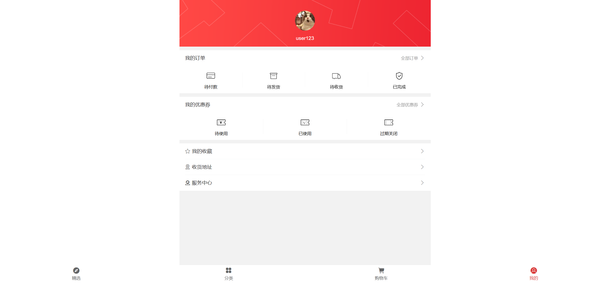
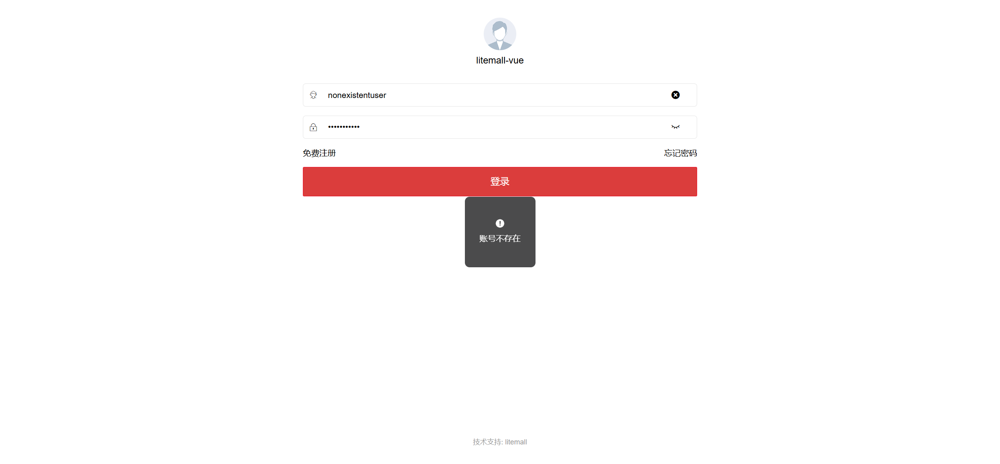
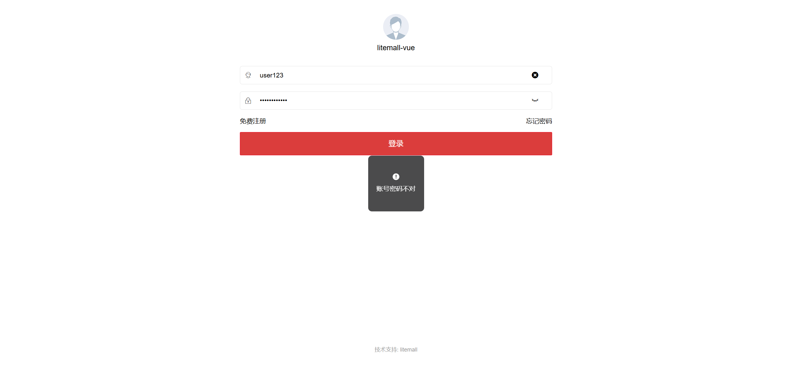
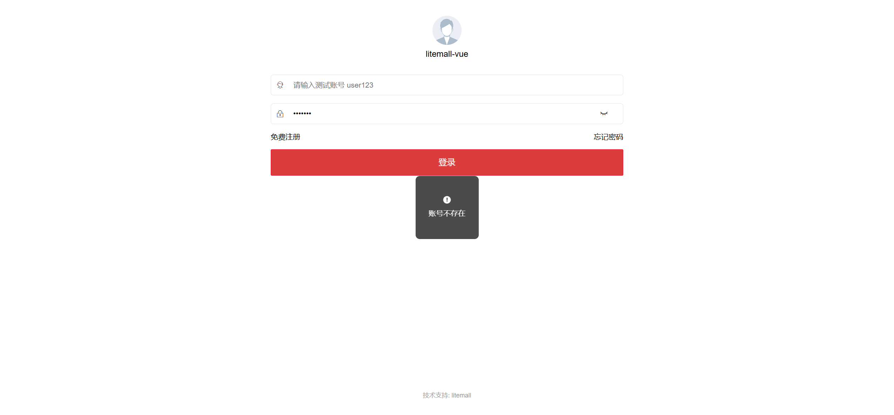
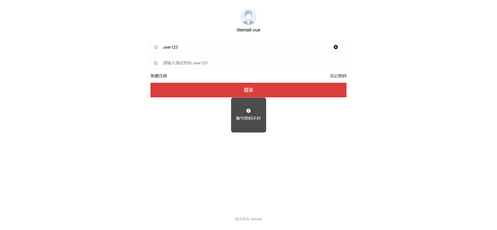

# UI测试用例文档 - 用户登录模块（自动化）

| 序号 | 用例编号 | 用例标题              | 模块     | 优先级 | 前置条件   | 测试步骤                                                                                         | 测试数据                                   | 预期结果                           | 执行结果 | 测试人     | 测试时间   | 实际结果                                             |
| ---- | -------- | --------------------- | -------- | ------ | ---------- | ------------------------------------------------------------------------------------------------ | ------------------------------------------ | ---------------------------------- | -------- | ---------- | ---------- | -------------------------------------------------- |
| 0    | Login001 | 成功登录流程          | 用户登录 | P0     | 用户已注册 | 1. 进入登录页面；` `2. 输入正确的用户名和密码；` `3. 点击登录按钮                      | 用户名：user123；密码：user123             | 登录成功，跳转至首页，显示用户信息 | 通过     | 测试工程师 | 2025/10/16 | 
| 1    | Login002 | 登录失败-用户名不存在 | 用户登录 | P1     | 无         | 1. 进入登录页面；` `2. 输入不存在的用户名；` `3. 输入任意密码；` `4. 点击登录按钮 | 用户名：nonexistentuser；密码：Password123 | 登录失败，提示"用户名不存在"       | 通过     | 测试工程师 | 2025/10/16 | 
| 2    | Login003 | 登录失败-密码错误     | 用户登录 | P1     | 用户已注册 | 1. 进入登录页面；` `2. 输入正确的用户名；` `3. 输入错误的密码；` `4. 点击登录按钮 | 用户名：user123；密码：WrongPass123        | 登录失败，提示"密码错误"           | 通过     | 测试工程师 | 2025/10/16 | 
| 3    | Login004 | 登录失败-用户名为空   | 用户登录 | P1     | 无         | 1. 进入登录页面；` `2. 不输入用户名；` `3. 输入任意密码；` `4. 点击登录按钮       | 用户名：空；密码：user123                  | 登录失败，提示"用户名不能为空"     | 不通过   | 测试工程师 | 2025/10/16 | 
| 4    | Login005 | 登录失败-密码为空     | 用户登录 | P1     | 无         | 1. 进入登录页面；` `2. 输入任意用户名；` `3. 不输入密码；` `4. 点击登录按钮       | 用户名：user123；密码：空                  | 登录失败，提示"密码不能为空"       | 不通过   | 测试工程师 | 2025/10/16 | 
