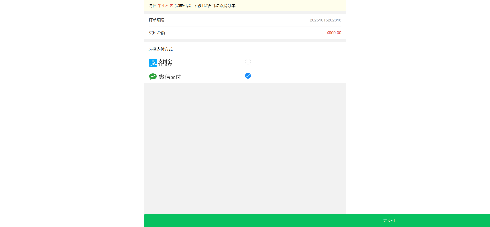
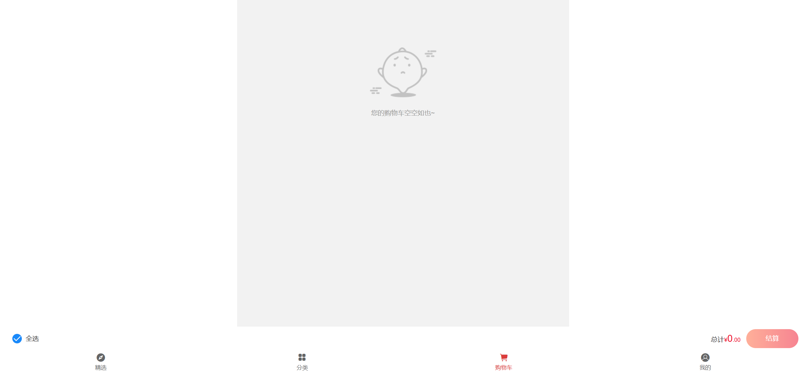

# UI测试用例文档 - 订单管理模块

## 提交订单功能测试用例（自动化）

| 序号 | 用例编号 | 用例标题                             | 模块     | 优先级 | 前置条件                                 | 测试步骤                                                                                                                                                      | 测试数据                                                                                                                                                                                                           | 预期结果                                      | 执行结果 | 测试人     | 测试时间   | 实际结果                                              |
| ---- | -------- | ------------------------------------ | -------- | ------ | ---------------------------------------- | ------------------------------------------------------------------------------------------------------------------------------------------------------------- | ------------------------------------------------------------------------------------------------------------------------------------------------------------------------------------------------------------------ | --------------------------------------------- | -------- | ---------- | ---------- | ----------------------------------------------------- |
| 0    | Order001 | 提交订单成功（全部参数填写正确）     | 下单业务 | P0     | 用户已登录，购物车有商品，有有效收货地址 | 1. 登录系统；` `2. 进入购物车；` `3. 选择商品并点击结算；` `4. 选择有效收货地址；` `5. 填写订单备注（≤200字符）；` `6. 点击提交订单 | 正确用户名、密码；订单备注：测试订单                                                                                                                                                                               | 订单提交成功，页面跳转至支付页面              | 通过     | 测试工程师 | 2025/10/16 |  |
| 1    | Order002 | 提交订单成功（全部必填参数填写正确） | 下单业务 | P0     | 用户已登录，购物车有商品，有有效收货地址 | 1. 登录系统；` `2. 进入购物车；` `3. 选择商品并点击结算；` `4. 选择有效收货地址；` `5. 不填写订单备注；` `6. 点击提交订单            | 正确用户名、密码                                                                                                                                                                                                   | 订单提交成功，页面跳转至支付页面              | 通过     | 测试工程师 | 2025/10/16 |  |
| 2    | Order003 | 提交订单失败（地址为空）             | 下单业务 | P1     | 用户已登录，购物车有商品                 | 1. 登录系统；` `2. 进入购物车；` `3. 选择商品并点击结算；` `4. 不选择收货地址；` `5. 点击提交订单                                         | 正确用户名、密码                                                                                                                                                                                                   | 提示"请选择收货地址"或类似错误信息            | 不通过   | 测试工程师 | 2025/10/16 |  |
| 3    | Order004 | 提交订单失败（购物车为空）           | 下单业务 | P1     | 用户已登录，有有效收货地址               | 1. 登录系统；` `2. 进入购物车（为空）；` `3. 点击结算并尝试提交订单                                                                                 | 正确用户名、密码                                                                                                                                                                                                   | 提示"请选择商品"或类似错误信息                | 不通过   | 测试工程师 | 2025/10/16 |  |
| 4    | Order005 | 提交订单失败（备注大于200个字符）    | 下单业务 | P1     | 用户已登录，购物车有商品，有有效收货地址 | 1. 登录系统；` `2. 进入购物车；` `3. 选择商品并点击结算；` `4. 选择有效收货地址；` `5. 填写订单备注（201个字符）；` `6. 点击提交订单 | 正确用户名、密码；订单备注：[201个字符的文本]                                                                                                                                                                      | 提示"订单备注不能超过200个字符"或类似错误信息 | 不通过   | 测试工程师 | 2025/10/16 |  |
| 5    | Order006 | 提交订单成功（100字符备注）          | 下单业务 | P1     | 用户已登录，购物车有商品，有有效收货地址 | 1. 登录系统；` `2. 进入购物车；` `3. 选择商品并点击结算；` `4. 选择有效收货地址；` `5. 填写订单备注（100字符）；` `6. 点击提交订单   | 正确用户名、密码；订单备注：测试测试测试测试测试测试测试测试测试测试测试测试测试测试测试测试测试测试测试测试测试测 试测试测试测试测试测试测试测试测试测试测试测试测试测试测试测试测试测试测试测试测试测试测试 | 订单提交成功，页面跳转至支付页面              | 通过     | 测试工程师 | 2025/10/16 |  |
