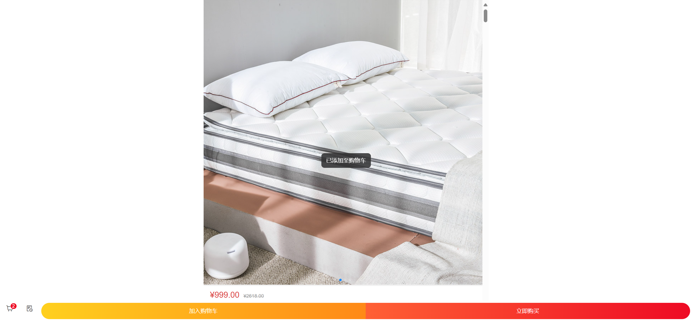
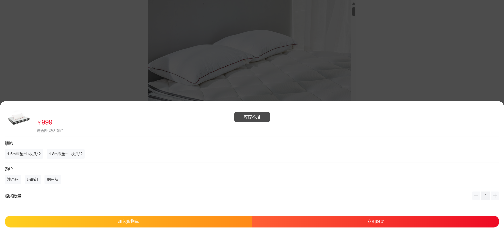

# UI测试用例文档 - 购物车模块

## 加入购物车功能测试用例（自动化）

| 序号 | 用例编号 | 用例标题                              | 模块   | 优先级 | 前置条件                          | 测试步骤                                                                                                                            | 测试数据               | 预期结果                                        | 执行结果 | 测试人     | 测试时间   | 实际结果                                                    |
| ---- | -------- | ------------------------------------- | ------ | ------ | --------------------------------- | ----------------------------------------------------------------------------------------------------------------------------------- | ---------------------- | ----------------------------------------------- | -------- | ---------- | ---------- | ----------------------------------------------------------- |
| 0    | Cart001  | 成功添加商品到购物车（数量1）         | 购物车 | P0     | 用户已登录，商品存在              | 1. 进入任意一个商品详情页；` `2. 选择商品规格；` `3. 点击"加入购物车"按钮；` `4. 查看购物车图标上的数量              | 数量：1                | 商品成功加入购物车，购物车图标上的数量更新为1   | 通过     | 测试工程师 | 2025/10/16 |   |
| 1    | Cart002  | 成功添加商品到购物车（数量50）        | 购物车 | P0     | 用户已登录，商品存在              | 1. 进入任意一个商品详情页；` `2. 选择商品规格；` `3. 点击"加入购物车"按钮；` `4. 查看购物车图标上的数量              | 数量：50               | 商品成功加入购物车，购物车图标上的数量更新为50  | 通过     | 测试工程师 | 2025/10/16 |   |
| 2    | Cart003  | 成功添加商品到购物车（库存量）        | 购物车 | P0     | 用户已登录，商品存在（库存量100） | 1. 进入任意一个商品详情页；` `2. 选择商品规格；` `3. 点击"加入购物车"按钮；` `4. 查看购物车图标上的数量              | 数量：100              | 商品成功加入购物车，购物车图标上的数量更新为150 | 通过     | 测试工程师 | 2025/10/16 |   |
| 3    | Cart004  | 成功添加商品到购物车（数量200）       | 购物车 | P0     | 用户已登录，商品存在              | 1. 进入任意一个商品详情页；` `2. 选择商品规格；` `3. 点击"加入购物车"按钮；` `4. 查看购物车图标上的数量              | 数量：200              | 商品成功加入购物车，购物车图标上的数量更新为200 | 通过     | 测试工程师 | 2025/10/16 |   |
| 4    | Cart005  | 成功添加不同规格商品到购物车（规格1） | 购物车 | P0     | 用户已登录，商品存在              | 1. 进入任意一个有多个规格的商品详情页；` `2. 选择商品规格1；` `3. 点击"加入购物车"按钮；` `4. 查看购物车图标上的数量 | 数量：2；规格：规格1   | 商品成功加入购物车，购物车图标上的数量更新为2   | 通过     | 测试工程师 | 2025/10/16 |   |
| 5    | Cart006  | 成功添加不同规格商品到购物车（规格2） | 购物车 | P0     | 用户已登录，商品存在              | 1. 进入任意一个有多个规格的商品详情页；` `2. 选择商品规格2；` `3. 点击"加入购物车"按钮；` `4. 查看购物车图标上的数量 | 数量：2；规格：规格2   | 商品成功加入购物车，购物车图标上的数量更新为2   | 通过     | 测试工程师 | 2025/10/16 |   |
| 6    | Cart007  | 成功添加不同规格商品到购物车（规格3） | 购物车 | P0     | 用户已登录，商品存在              | 1. 进入任意一个有多个规格的商品详情页；` `2. 选择商品规格3；` `3. 点击"加入购物车"按钮；` `4. 查看购物车图标上的数量 | 数量：2；规格：规格3   | 商品成功加入购物车，购物车图标上的数量更新为2   | 通过     | 测试工程师 | 2025/10/16 |   |
| 7    | Cart008  | 成功添加不同规格商品到购物车（规格4） | 购物车 | P0     | 用户已登录，商品存在              | 1. 进入任意一个有多个规格的商品详情页；` `2. 选择商品规格4；` `3. 点击"加入购物车"按钮；` `4. 查看购物车图标上的数量 | 数量：2；规格：规格4   | 商品成功加入购物车，购物车图标上的数量更新为2   | 通过     | 测试工程师 | 2025/10/16 |   |
| 8    | Cart009  | 成功添加不同规格商品到购物车（规格5） | 购物车 | P0     | 用户已登录，商品存在              | 1. 进入任意一个有多个规格的商品详情页；` `2. 选择商品规格5；` `3. 点击"加入购物车"按钮；` `4. 查看购物车图标上的数量 | 数量：2；规格：规格5   | 商品成功加入购物车，购物车图标上的数量更新为2   | 通过     | 测试工程师 | 2025/10/16 |   |
| 9    | Cart010  | 成功添加不同规格商品到购物车（规格6） | 购物车 | P0     | 用户已登录，商品存在              | 1. 进入任意一个有多个规格的商品详情页；` `2. 选择商品规格6；` `3. 点击"加入购物车"按钮；` `4. 查看购物车图标上的数量 | 数量：2；规格：规格6   | 商品成功加入购物车，购物车图标上的数量更新为2   | 通过     | 测试工程师 | 2025/10/16 |  |
| 10   | Cart011  | 数量为0添加购物车                     | 购物车 | P1     | 用户已登录，商品存在              | 1. 进入任意一个商品详情页；` `2. 选择商品规格；` `3. 将购买数量修改为0；` `4. 点击"加入购物车"按钮                   | 数量：0                | 提示"购买数量不能为0"或类似错误信息             | 不通过   | 测试工程师 | 2025/10/16 |  |
| 11   | Cart012  | 数量为201添加购物车                   | 购物车 | P1     | 用户已登录，商品存在              | 1. 进入任意一个商品详情页；` `2. 选择商品规格；` `3. 将购买数量修改为201；` `4. 点击"加入购物车"按钮                 | 数量：201              | 提示"购买数量不能超过200"或类似错误信息         | 不通过   | 测试工程师 | 2025/10/16 |  |
| 12   | Cart013  | 数量超出库存量添加购物车              | 购物车 | P1     | 用户已登录，商品存在（库存量100） | 1. 进入任意一个商品详情页；` `2. 选择商品规格；` `3. 将购买数量修改为200；` `4. 点击"加入购物车"按钮                 | 数量：200；库存量：100 | 提示"购买数量不能超过库存量"或类似错误信息      | 不通过   | 测试工程师 | 2025/10/16 |  |
| 13   | Cart014  | 空数量添加购物车                      | 购物车 | P1     | 用户已登录，商品存在              | 1. 进入任意一个商品详情页；` `2. 选择商品规格；` `3. 清空购买数量输入框；` `4. 点击"加入购物车"按钮                  | 数量：空               | 提示"请输入购买数量"或类似错误信息              | 不通过   | 测试工程师 | 2025/10/16 |  |
| 14   | Cart015  | 未选择商品规格添加购物车              | 购物车 | P1     | 用户已登录，商品存在              | 1. 进入任意一个需要选择规格的商品详情页；` `2. 不选择商品规格；` `3. 点击"加入购物车"按钮                                 | 数量：2                | 提示"请选择商品规格"或类似错误信息              | 不通过   | 测试工程师 | 2025/10/16 |  |
